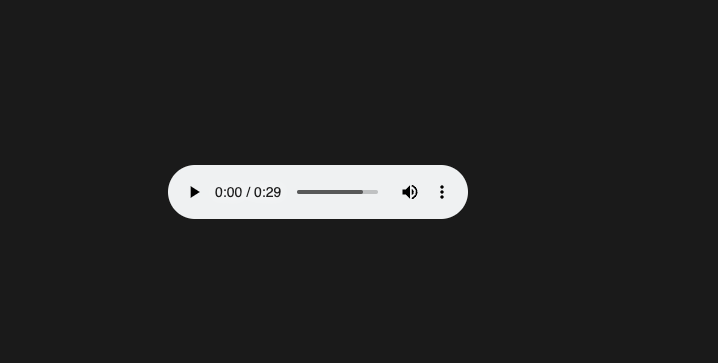

# MindWave

## Overview

This project is a React Native application designed to promote mental well-being through personalized music therapy and mental health assistance. It integrates EEG-based emotion recognition, sentiment analysis, music generation, and therapeutic activities. Users can access curated playlists, generate custom music, and engage in meditation and brain-activating games.


## Key Features

### 1. **User Authentication**
- Users can create an account and log in securely.
- Authentication ensures personalized experiences and data security.

### 2. **EEG-Based Emotion Recognition**
- Users input EEG-derived values (AVD values) for emotion recognition.
- The system uses these values to determine the user's current mood.

### 3. **Sentiment Analysis**
- Users can input text to analyze their sentiment.
- Mood is recognized based on the sentiment and used for further personalization.

### 4. **Personalized Music Playlists**
- Songs are fetched from the **Jamendo API** based on the user’s mood.
- A curated playlist is presented to the user.

### 5. **Music Generation**
- Custom music generation is powered by:
  - **LangChain**: Used for orchestrating the AI-driven music generation pipeline.
  - **Lightning AI**: Utilizes GPU acceleration for fast and efficient model execution.
  - **Ngrok**: Hosts the URL for fetching music generation services from client.

### 6. **Meditation Tab**
- Provides therapeutic themes like:
  - **Rain**
  - **Fire** and more 
  - Other calming soundscapes.
- Users can set timers for their meditation sessions.
- Music adapts to the user’s mood and location (if shared).

### 7. **Brain Games**
- Includes games like Sudoku to activate both the left and right hemispheres of the brain.
- Enhances cognitive function and mental stimulation.

### 8. **Mood Tracking**
- Tracks the user’s mood over time.
- Provides insights and trends to help users understand their emotional well-being.

### 9. **Journaling**
- Users can log their thoughts and experiences.
- Journals are integrated with mood tracking for deeper insights.

### 10. **Therapy Assistant**
- Offers a mental health assistant for guided therapy sessions.
- Incorporates techniques for stress relief, anxiety management, and overall mental health improvement.

## Technical Stack

### Frontend
- **React Native**: For cross-platform mobile development.

### Backend
- **LangChain**: Orchestrates the machine learning pipeline.
- **Lightning AI**: Handles AI model execution with GPU support.
- **Ngrok**: Provides URL hosting for music generation services.

### APIs
- **Jamendo API**: Fetches music based on mood analysis.

### Libraries and Tools
- **EEG Data Analysis Tools**: For processing AVD values.
- **Sentiment Analysis Models**: Analyzes text input for mood detection.
- **Pydub**: Processes and generates audio files.
- **Timer Functionality**: For meditation and task tracking.

### Hosting
- **Ngrok**: Exposes local backend services for external access.

## Installation and Setup

### Prerequisites
- Node.js
- React Native CLI
- Python 3.10+
- Ngrok
- Lightning AI setup with GPU support

### Steps

1. **Clone the Repository**:

   ```bash
   git clone https://github.com/AD1t12407/MindWave-Minor.git
   cd MindWave-Minor
   ```

2. **Install Dependencies**:

   ```bash
   npm install
   ```

### Environment Variables

Create a `.env` file in the project root and add the following:

```env
JAMENDO_API_KEY=<your-jamendo-api-key>
NGROK_URL=<Authentication-key>
```
## Usage with Screenshots

### 1. **Login/Sign Up**:
   - Create an account or log in to access personalized features.
   <br>
   
   <br>
   
   <br>
   

### 2. **Input EEG Values**:
   - Navigate to the EEG tab and input AVD values for mood detection.
   <br>
   
   <br>
   

### 3. **Sentiment Analysis**:
   - Enter text in the sentiment analysis section to detect mood.

### 4. **Access Playlists**:
   - View a curated playlist based on your mood.
   <br>
   
   <br>
   

### 5. **Meditation**:
   - Choose a therapeutic theme or set a timer for a session.
   <br>
   
   <br>
   
   <br>
   - Location-based music generation using MusicGen (Facebook)
   <br>
   
   <br>
   

### 6. **Brain Games**:
   - Play Sudoku or other games to stimulate cognitive function.
   <br>
   

### 7. **Track Mood**:
   - Monitor mood trends and insights in the tracking section.
   <br>
   

### 8. **Journal**:
   - Log daily thoughts and link them with mood data to enhance the models’ performance.
   <br>
   
   <br>
   
   <br>
   


## Future Enhancements

- Integration with wearables for real-time EEG data.
- Support for additional languages and regional music preferences.
- Enhanced AI models for deeper mood analysis.
- Community features for shared therapy and playlists.

## Contributing

Contributions are welcome! Please fork the repository and submit a pull request for any feature additions or bug fixes.

## DEMO
recording of the demo is in utils/demo.mp4
<video src="../MindWave-Minor/utils/Screen Recording 2025-04-12 at 2.42.03 PM.mov" width="300" >

